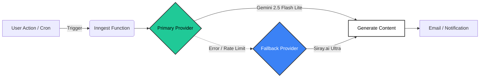

  
  <h1>OpenStock API & Architecture</h1>
  
  

    <b>Modern. Open. Resilient.</b>
  

  

    
    
    
  

---

## 🏗️ Architecture Overview

OpenStock leverages a resilient event-driven architecture powered by **Inngest**. We prioritize uptime for our generative features by utilizing a multi-provider AI strategy.

### 🧠 Intelligent Model Routing

We don't rely on a single point of failure. Our AI infrastructure automatically routes around outages.

---

## 🤝 AI Partners

### Primary: Google Gemini
The workhorse of our generative content. Fast, efficient, and deeply integrated via Inngest.

### Fallback: Siray.ai
> [!IMPORTANT]
> **Zero Downtime Guarantee.**
> When Gemini wavers, **Siray.ai** takes over instantly. No user request is ever dropped.

   
  
  
<i>The robust infrastructure backing OpenStock.</i>

---

## ⚡ Serverless Functions (Inngest)

Our background jobs are defined in `lib/inngest/functions.ts`. This is a
private, single-owner deployment, so the multi-user broadcast/re-engagement
jobs that existed upstream (a weekly newsletter and an inactive-user
win-back email, both built on a Kit/ConvertKit integration) were removed —
see `docs/architecture.md`. Only two jobs remain:

| ID | Type | Schedule/Trigger | Purpose |
| :--- | :--- | :--- | :--- |
| `sign-up-email` | 🔔 Event | `app/user.created` | **Personalized Onboarding.** Generates a custom welcome message based on user quiz results (optional — skipped automatically if AI/email aren't configured). |
| `check-stock-alerts` | ⏱️ Cron | `*/5 * * * *` | **Real-time Monitoring.** Checks user price targets against live market data. |

---

## 🔌 API Integrations

Accessed exclusively through `lib/market-data/` (see `docs/market-data.md`)
— nothing else in the app talks to a provider directly.

<b>📈 Stock Data: Finnhub</b>

 

*   **Base URL:** `https://finnhub.io/api/v1`
*   **Key Features:** Real-time quotes, company profiles/financials, market news, symbol search.
*   **Auth:** `FINNHUB_API_KEY` (server-side only — no `NEXT_PUBLIC_` prefix)
*   **Historical daily bars:** the free tier does not include Finnhub's candle endpoint for most keys; falls back to Stooq's free daily-bar CSV (no key required) — see `docs/market-data.md`.

<b>🗄️ Database: MongoDB Atlas</b>

 

*   **Connection:** Standard URI (DNS SRV bypassed for maximum reliability).
*   **Collections:** `users`, `watchlists`, `alerts`.

---

  Documentation © Open Dev Society. Built with ❤️ for the Open Source Community.

